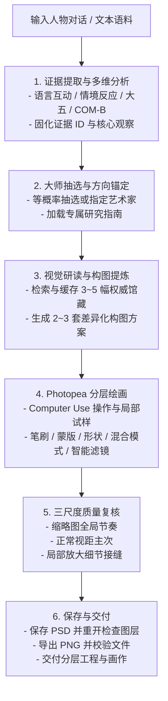
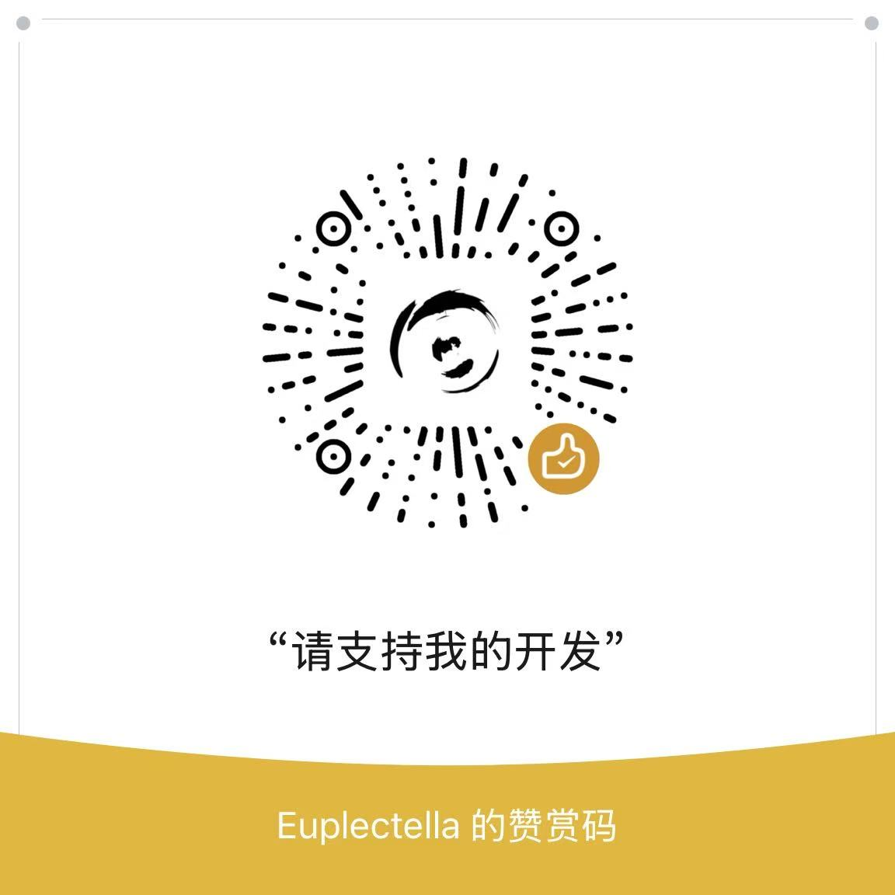

# 言之有画 (Verba Picta) —— 人物性格侧写抽象画生成SKILL

欸？康定斯基为我作画？！

[English](README_EN.md) | [中文](README.md)

[](photopea-abstract-portrait/SKILL.md)
[](LICENSE)
[](requirements.txt)
[](photopea-abstract-portrait/references/photopea-workflow.md)

---

## 🌟 核心特色与设计亮点


**三天微信对话生成，米罗风格**

- 🎨 **Computer Use 原生分层绘画**：基于视觉与交互控制，Agent 在 Photopea 浏览器环境中原生操作软硬笔刷、涂抹、选区、蒙版、混合模式与智能滤镜，按大师艺术风格塑造多层质感与骨架，交付可二次编辑的分层 PSD 与高清晰度 PNG。
- 🔬 **行为科学证据链**：基于语言互动模式、情境-反应模型、大五人格特质与 COM-B 行为系统，建立严格溯源的共用证据表。事实推断与视觉转译保持单向映射，确保画像具备扎实的行为学支撑。
- 🏛️ **14 位艺术大师学术策展库**：精选康定斯基、毕加索、蒙德里安、马列维奇、克利、米罗、德劳内、罗斯科、波洛克、马丁、克林特、赵无极、弗兰肯塔勒、克莱因等 14 位先驱，涵盖 43 个风格时期。109 件代表作均追溯至 MoMA、蓬皮杜艺术中心、古根海姆博物馆及艺术家官方基金会权威馆藏。

---

## 🔄 全流程架构



---

## 🎨 艺术家谱系与创作方向矩阵

知识库全面覆盖 14 位艺术大师，每位艺术家均配有开箱即用的默认代表作品组与详尽研究指南：

| 艺术家                         | 默认研究方向与时期                      | 代表作品典藏机构            | 艺术语言核心特质                               | 专属指南                                                                          |
| ------------------------------ | --------------------------------------- | --------------------------- | ---------------------------------------------- | --------------------------------------------------------------------------------- |
| **瓦西里·康定斯基**     | 坎贝尔壁画组：抒情性非具象 (1914)       | MoMA (纽约现代艺术博物馆)   | 方向性大色带、音乐性动态线条、冷暖色团交响     | [指南](photopea-abstract-portrait/references/visual-guides/wassily-kandinsky.md)   |
| **巴勃罗·毕加索**       | 身体变形与多视角人物 (1930–1932)       | MoMA                        | 多重视角轮廓交叠、体量变形、黑粗轮廓与肤色对比 | [指南](photopea-abstract-portrait/references/visual-guides/pablo-picasso.md)       |
| **皮特·蒙德里安**       | 新造型主义正交平衡 (1920–1929)         | MoMA                        | 纯粹垂直与水平黑线、非对称原色块、积极空间留白 | [指南](photopea-abstract-portrait/references/visual-guides/piet-mondrian.md)       |
| **卡济米尔·马列维奇**   | 至上主义悬浮色块 (1915–1917)           | MoMA                        | 白场空间悬浮感、纯粹几何形态、偏心动势平衡     | [指南](photopea-abstract-portrait/references/visual-guides/kazimir-malevich.md)    |
| **保罗·克利**           | 面具与线性色面的象征性造型 (1924–1928) | MoMA                        | 面具式几何提炼、诗性细线律动、手工质感温和色层 | [指南](photopea-abstract-portrait/references/visual-guides/paul-klee.md)           |
| **胡安·米罗**           | 梦境绘画与开放场 (1923–1926)           | MoMA                        | 极简开放背景、生物形态符号、高纯度色彩点缀     | [指南](photopea-abstract-portrait/references/visual-guides/joan-miro.md)           |
| **索尼娅·德劳内**       | 早期同时性：色面对比与节奏 (1913–1915) | 蓬皮杜艺术中心 / 提森博物馆 | 同心环同心圆弧、邻接色对比、舞动色块节奏       | [指南](photopea-abstract-portrait/references/visual-guides/sonia-delaunay.md)      |
| **马克·罗斯科**         | 成熟期叠置色域 (1950–1958)             | MoMA                        | 巨幅叠置色块、渗透式晕染软边、深邃情绪场域     | [指南](photopea-abstract-portrait/references/visual-guides/mark-rothko.md)         |
| **杰克逊·波洛克**       | 浇洒与全幅网络 (1947–1950)             | MoMA                        | 全局贯通多层滴流线网、疏密梯度、去中心化动势   | [指南](photopea-abstract-portrait/references/visual-guides/jackson-pollock.md)     |
| **阿格尼丝·马丁**       | 细网格与微差 (1963–1964)               | MoMA                        | 均质细线网格、呼吸感微温差、极简秩序美学       | [指南](photopea-abstract-portrait/references/visual-guides/agnes-martin.md)        |
| **希尔玛·阿芙·克林特** | 《十大》组作有机形与几何关系 (1907)     | 希尔玛基金会 / 泰特美术馆   | 螺旋卵形有机演化、粉彩明丽基调、图腾式象征形态 | [指南](photopea-abstract-portrait/references/visual-guides/hilma-af-klint.md)      |
| **赵无极**               | 动势、密度与开放空间 (1961–1969)       | 赵无极基金会                | 狂草笔势聚散、多维灰调冷暖层叠、深邃大气空间   | [指南](photopea-abstract-portrait/references/visual-guides/zao-wou-ki.md)          |
| **海伦·弗兰肯塔勒**     | 浸染色域与线性骨架 (1952–1957)         | 弗兰肯塔勒基金会 / MoMA     | 浸润通透色场、底色呼吸通道、轻盈有机轮廓       | [指南](photopea-abstract-portrait/references/visual-guides/helen-frankenthaler.md) |
| **弗朗兹·克莱因**       | 黑白结构与笔势 (1950–1955)             | MoMA                        | 磅礴黑白互锁结构、主动负空间造型、刚劲张力笔触 | [指南](photopea-abstract-portrait/references/visual-guides/franz-kline.md)         |

完整作品名录与图像链接详见 [docs/artist-resources.md](docs/artist-resources.md)。

---

## 📦 交付成果与规格标准

任务完成后提供：

1. **PNG 画作**：通过 `File > Export As > PNG` 导出，长边默认 $\ge 2000\text{ px}$。
2. **分层 PSD**：通过 `File > Save as PSD` 保存，并在 Photopea 重开核对主要色层、结构、蒙版与滤镜。工程可通过 `File > Open` 继续编辑。
3. **创作与转译报告**：精简阐明所选艺术大师与风格方向、核心参考画作、3~4 项核心行为特征与视觉形态的映射关系，以及具体的技法运用。
4. **过程资产归档**：会话状态完整保存在 `work/portrait/session.json`，成品与检验清单保存在 `outputs/portrait/`。

---

## 🚀 快速上手与运行环境

### 推荐模型 (Recommended Models)

本 Skill 的核心绘制环节依托 Agent 对原生 Photopea 画布的细粒度控制。为保障复杂矢量图形绘制、色彩配置与图层编排的精准度，**强烈推荐使用具备前沿视觉操作能力的最新旗舰模型**：

- **OpenAI Astra**：具备卓越的屏幕空间几何理解、多尺度视觉注意力与端到端复杂工具协同调用能力。
- **Fable 5.1**：在细粒度 GUI 元素识别、坐标微调对齐与多步连续鼠标轨迹规划上展现高稳定度表现。
- **推荐原因**：抽象肖像制作涉及在 Photopea 编辑器中开展大色域铺陈、连续曲线锚点调节、半透明遮罩叠加、精确色值选取以及多图层分组锁定等高频精细 GUI 交互；最新旗舰模型拥有出色的原生视觉操作精度与空间推理能力，能有效避免定位漂移与交互试错，充分还原现代艺术大师的构图精髓与质感细节。

### 环境要求

- **宿主环境**：具备 **Computer Use** 控制能力（支持屏幕截图、鼠标点击与连续拖拽、键盘输入及本地文件交互）的智能体运行环境；可访问 Photopea。
- **运行模式**：支持全流程由 Agent 在 Photopea 中自主建构并绘制作品；在无 GUI 交互的纯文本或分析环境下，亦可独立运行语料分析、行为证据提取与学术构图设计模块。
- **Python 运行环境**：Python 3.10+。
- **脚本依赖**：Pillow 用于参考图与 PNG 校验，psd-tools 用于分层 PSD 工程校验。

```shell
python -m pip install -r requirements.txt
```

### 技能安装

将 [photopea-abstract-portrait/](photopea-abstract-portrait/) 文件夹复制至宿主指定的技能目录即可。入口配置为 [photopea-abstract-portrait/SKILL.md](photopea-abstract-portrait/SKILL.md)，平台元数据描述见 [photopea-abstract-portrait/agents/openai.yaml](photopea-abstract-portrait/agents/openai.yaml)。

### 调用 Prompt 示例

```text
使用 photopea-abstract-portrait。

目标人物：李明（某开源社区技术带头人）
对话或语料：
[附上目标人物近期在架构选型、技术评审中的代表性讨论、日常交流与复盘发言材料...]

指定艺术家或排除名单（可选）：排除 毕加索
颜色、质感或元素偏好（可选）：偏好深蓝与冷灰，需要有强烈的结构感
画幅与用途（可选）：1600x2000 px 纵向海报
肖像显性程度（可选）：隐约人形
已有 PSD 文件路径（修改任务时提供）：
```

---

## 🛠️ 本地工程脚本与自动化测试

Python 工具链负责参考资产、抽选与文件校验；画面由 computer use 在编辑器中制作。

### 1. 艺术家抽选引擎 (`select_artist.py`)

在候选艺术家池中执行等概率无偏随机抽选，自动处理别名映射与排除项，并支持断点续创：

```shell
# 默认等概率随机抽取
python photopea-abstract-portrait/scripts/select_artist.py --session work/portrait/session.json

# 指定艺术家或排除名单
python photopea-abstract-portrait/scripts/select_artist.py --session work/portrait/session.json --artist 赵无极
python photopea-abstract-portrait/scripts/select_artist.py --session work/portrait/session.json --exclude 毕加索 --exclude 波洛克
```

### 2. 参考资产准备与拉取 (`reference_assets.py`)

生成结构化参考资产清单，拉取权威馆藏原图至本地并生成多图比对联系表：

```shell
# 校验整个资产库的合法性
python photopea-abstract-portrait/scripts/reference_assets.py validate

# 准备参考清单并拉取图像缓存
python photopea-abstract-portrait/scripts/reference_assets.py prepare --session work/portrait/session.json --out work/portrait/references.json
python photopea-abstract-portrait/scripts/reference_assets.py fetch --manifest work/portrait/references.json --out-dir work/portrait/references --contact-sheet work/portrait/reference-sheet.png

# 重新生成 Markdown 索引表格
python photopea-abstract-portrait/scripts/reference_assets.py table --out docs/artist-resources.md
```

### 3. 交付质量与结构校验 (`verify_delivery.py`)

检查 PNG／PSD 解码、尺寸一致性、PSD 内容层数量与人工观察记录。图层至少两个，默认长边至少 2000 px；实际图层编辑效果与审美质量由操作者复核。

```shell
python photopea-abstract-portrait/scripts/verify_delivery.py --session work/portrait/session.json --image outputs/portrait/portrait.png --project outputs/portrait/portrait.psd --out outputs/portrait/delivery-check.json
```

### 4. 运行单元测试套件

```shell
python -m unittest discover -s tests -v
```

---

## 📁 仓库结构

```text
.
├── LICENSE                                    # CC BY-NC 4.0 开源许可协议
├── README.md                                  # 中文文档
├── README_EN.md                               # 英文文档
├── requirements.txt
├── assets/
│   ├── sponsor-alipay.jpg
│   └── sponsor-wechat.jpg
├── docs/
│   └── artist-resources.md                    # 14 位艺术家作品速查与馆藏索引
├── tests/
│   └── test_scripts.py
└── photopea-abstract-portrait/
    ├── SKILL.md
    ├── agents/
    │   └── openai.yaml                        # 平台元数据与配置
    ├── references/
    │   ├── artist-catalog.json                # 结构化核心资产库 (14 艺术家 / 109 作品)
    │   ├── portrait-evidence.md               # 四维行为科学证据提取与转译规范
    │   ├── photopea-workflow.md               # 基于 Computer Use 的 Photopea 绘制与交互规范
    │   ├── resource-workflow.md               # 资料维护标准与资产管线工作流
    │   ├── evaluation-cases.md                # 行为一致性与验证案例矩阵
    │   └── visual-guides/                     # 14 位艺术大师的独立创作与视觉指南
    │       ├── agnes-martin.md
    │       ├── franz-kline.md
    │       ├── helen-frankenthaler.md
    │       ├── hilma-af-klint.md
    │       ├── jackson-pollock.md
    │       ├── joan-miro.md
    │       ├── kazimir-malevich.md
    │       ├── mark-rothko.md
    │       ├── pablo-picasso.md
    │       ├── paul-klee.md
    │       ├── piet-mondrian.md
    │       ├── sonia-delaunay.md
    │       ├── wassily-kandinsky.md
    │       └── zao-wou-ki.md
    └── scripts/
        ├── select_artist.py
        ├── reference_assets.py
        └── verify_delivery.py
```

---

## 📖 数据治理与开源许可

本项目开源遵循 **[Creative Commons Attribution-NonCommercial 4.0 International (CC BY-NC 4.0)](LICENSE)** 协议。

- **科研与公共传播（Attribution 署名）**：
  - 允许在非商业前提下自由使用、研究、修改与分发本项目的结构、提示词体系与工程工作流。
  - 在学术论文、科研报告、技术博客、社交媒体或公共演示中引用或展示本项目时，**必须明确标注原作者及项目出处**。
- **商业使用许可（Non-Commercial 商业限制）**：
  - 未经书面授权，不得将本项目、核心提示词、策展资产库或衍生工作流直接或间接用于营利性商业服务、商业软件集成、付费咨询或商用产品。
  - **商业授权联络**：如需商业使用或定制合作，请通过 GitHub Profile 联系作者或提交 Issue 洽谈授权。
- **元数据与图式版权**：作品事实与元数据依托 MoMA 开放数据集与权威博物馆公开展出信息整理。
- **运行无状态原则**：单次任务产生的语料、临时草稿与成果仅留存在工作目录（`work/` 和 `outputs/`），技能核心目录保持无状态与纯净。
- **可复现性保障**：支持通过 `--seed` 参数实现抽选可复现，服务于自动化评测与确定性验证。

### 引用格式 (Citation)

如在学术研究或开源成果中引用本项目，请使用以下格式：

```bibtex
@misc{verbapicta2026,
  author = {Combjellyshen},
  title = {言之有画 (Verba Picta): 基于行为科学证据与 Photopea 分层绘画的抽象肖像生成系统},
  year = {2026},
  publisher = {GitHub},
  journal = {GitHub repository},
  howpublished = {\url{https://github.com/Combjellyshen/verba-picta}},
  note = {Version 2.0.0, Licensed under CC BY-NC 4.0}
}
```

```text
Combjellyshen. (2026). 言之有画 (Verba Picta): 基于行为科学证据与 Photopea 分层绘画的抽象肖像生成系统 (Version 2.0.0) [Computer software]. GitHub. https://github.com/Combjellyshen/verba-picta
```

---

## ☕ 支持开发 / Sponsor

如果您觉得本 Skill 为您的生活赋予了一点乐趣与灵感，欢迎赞赏支持作者的持续研发与迭代！

<div align="center">
  <table>
    <tr>
      <td align="center" width="320">
        
        <br />
        <b>支付宝赞赏 (Alipay)</b>
      </td>
      <td align="center" width="320">
        
        <br />
        <b>微信赞赏 (WeChat Pay)</b>
      </td>
    </tr>
  </table>
</div>
