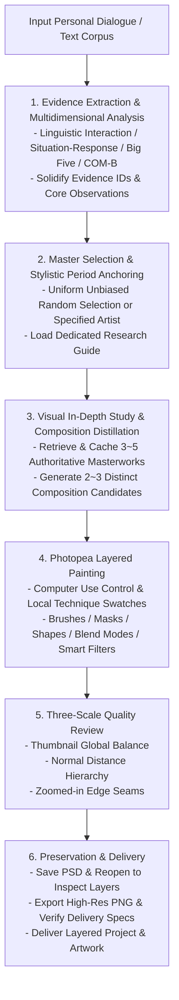

# Verba Picta —— Abstract Portrait Generation Skill from Personality Profiling

*Wait, Kandinsky is painting a portrait for me?!*

[English](README_EN.md) | [中文](README.md)

[](photopea-abstract-portrait/SKILL.md)
[](LICENSE)
[](requirements.txt)
[](photopea-abstract-portrait/references/photopea-workflow.md)

---

## 🌟 Key Features & Highlights


**Generated from 3 days of WeChat dialogue, Joan Miró style**

- 🎨 **Computer Use Native Layered Digital Painting**: Moving beyond flat bitmap outputs from conventional diffusion models, the AI Agent directly operates the Photopea browser UI via vision-interactive controls. It natively manipulates soft/hard brushes, color smudging, marquee feathering, raster/vector masks, layer blend modes, and smart filters to create multi-layered textures and skeletal compositions, delivering fully editable layered PSD projects alongside high-resolution PNG exports.
- 🔬 **Behavioral Science Evidence Chain**: Grounded in linguistic interaction patterns, situational-response models, the Big Five personality traits, and the COM-B behavioral system, the system establishes a rigorously traceable shared evidence table. Fact inference and artistic interpretation maintain a strict unidirectional mapping, ensuring solid behavioral grounding for every portrait.
- 🏛️ **Academic Curatorial Library of 14 Modern Masters**: Featuring 14 pioneering abstract masters—Wassily Kandinsky, Pablo Picasso, Piet Mondrian, Kazimir Malevich, Paul Klee, Joan Miró, Sonia Delaunay, Mark Rothko, Jackson Pollock, Agnes Martin, Hilma af Klint, Zao Wou-Ki, Helen Frankenthaler, and Franz Kline—spanning 43 distinct stylistic periods. All 109 representative works are sourced from authoritative collections including MoMA, Centre Pompidou, the Guggenheim Museum, and official artist foundations.

---

## 🔄 End-to-End Workflow Architecture



---

## 🎨 Master Lineage & Stylistic Matrix

The knowledge base covers 14 modern art masters, each accompanied by an out-of-the-box default working set and an in-depth research guide:

| Artist | Default Research Period & Direction | Primary Collecting Institution | Core Stylistic Characteristics | Research Guide |
|---|---|---|---|---|
| **Wassily Kandinsky** | Campbell Mural Panels: Lyrical Non-Objective (1914) | MoMA (Museum of Modern Art) | Directional broad color bands, musical dynamic lines, symphonic warm/cool chromatic masses | [Guide](photopea-abstract-portrait/references/visual-guides/wassily-kandinsky.md) |
| **Pablo Picasso** | Bodily Metamorphosis & Multi-Perspective Figures (1930–1932) | MoMA | Multi-perspective overlapping silhouettes, volumetric distortions, heavy black contours vs. flesh tones | [Guide](photopea-abstract-portrait/references/visual-guides/pablo-picasso.md) |
| **Piet Mondrian** | Neoplastic Orthogonal Equilibrium (1920–1929) | MoMA | Pure vertical & horizontal black bars, asymmetrical primary color blocks, active white spatial intervals | [Guide](photopea-abstract-portrait/references/visual-guides/piet-mondrian.md) |
| **Kazimir Malevich** | Suprematist Suspended Color Masses (1915–1917) | MoMA | Suspended spatial dynamic in white field, pure geometric planes, off-center equilibrium | [Guide](photopea-abstract-portrait/references/visual-guides/kazimir-malevich.md) |
| **Paul Klee** | Mask & Linear Color Planes: Symbolic Form (1924–1928) | MoMA | Mask-like geometric distillation, poetic delicate line rhythms, gentle artisanal multi-layered washes | [Guide](photopea-abstract-portrait/references/visual-guides/paul-klee.md) |
| **Joan Miró** | Dream Paintings & Open Fields (1923–1926) | MoMA | Minimalist open ground, biomorphic floating symbols, accents of saturated primary colors | [Guide](photopea-abstract-portrait/references/visual-guides/joan-miro.md) |
| **Sonia Delaunay** | Early Simultaneity: Chromatic Contrast & Rhythm (1913–1915) | Centre Pompidou / Thyssen Museum | Intersecting concentric arcs, adjacent simultaneous contrasts, rhythmic dancing color bands | [Guide](photopea-abstract-portrait/references/visual-guides/sonia-delaunay.md) |
| **Mark Rothko** | Mature Superimposed Color Fields (1950–1958) | MoMA | Monumental floating rectangles, soft diffused bleed edges, deep contemplative emotional fields | [Guide](photopea-abstract-portrait/references/visual-guides/mark-rothko.md) |
| **Jackson Pollock** | Pouring & All-Over Dynamic Web (1947–1950) | MoMA | Decentered continuous linear meshes, density gradients, interconnected kinetic trajectories | [Guide](photopea-abstract-portrait/references/visual-guides/jackson-pollock.md) |
| **Agnes Martin** | Fine Grids & Subtle Micro-Variations (1963–1964) | MoMA | Homogeneous fine line grids, breathing micro-temperatures, minimalist structural order | [Guide](photopea-abstract-portrait/references/visual-guides/agnes-martin.md) |
| **Hilma af Klint** | *The Ten Largest*: Biomorphic & Geometric Relations (1907) | Hilma af Klint Foundation / Tate | Spiral-ovoid evolutionary forms, luminous pastel palette, totem-like symbolic structures | [Guide](photopea-abstract-portrait/references/visual-guides/hilma-af-klint.md) |
| **Zao Wou-Ki (赵无极)** | Kinetic Energy, Density & Open Space (1961–1969) | Zao Wou-Ki Foundation | Cursive script calligraphy energy, multi-dimensional layered greys, profound atmospheric depth | [Guide](photopea-abstract-portrait/references/visual-guides/zao-wou-ki.md) |
| **Helen Frankenthaler** | Soak-Stain Color Fields & Linear Scaffolding (1952–1957) | Frankenthaler Foundation / MoMA | Luminous soak-stained color fields, unprimed canvas breathing corridors, fluid organic contours | [Guide](photopea-abstract-portrait/references/visual-guides/helen-frankenthaler.md) |
| **Franz Kline** | Black-and-White Structure & Gesture (1950–1955) | MoMA | Monumental interlocking black/white architecture, active negative space carving, muscular dynamic brushstrokes | [Guide](photopea-abstract-portrait/references/visual-guides/franz-kline.md) |

For complete catalog metadata and image access citations, see [docs/artist-resources.md](docs/artist-resources.md).

---

## 📦 Deliverables & Quality Standards

Upon task completion, the workflow produces:

1. **High-Resolution PNG Artwork**: Exported via `File > Export As > PNG`, default long edge $\ge 2000\text{ px}$.
2. **Layered PSD Project File**: Saved via `File > Save as PSD`, and reopened in Photopea to verify primary color fields, structural lines, masks, and smart filters. The project can be endlessly iterated in Photopea, Photoshop, or any PSD-compatible software.
3. **Creation & Interpretation Report**: Concisely explains the chosen artistic master and period, core reference works, mappings between 3~4 core behavioral traits and visual motifs, and specific digital painting techniques applied.
4. **Session Archival**: Complete session state preserved in `work/portrait/session.json`; finished deliverables and verification reports in `outputs/portrait/`.

---

## 🚀 Quick Start & Environment

### Recommended Models

The painting phase relies on fine-grained Agent control over the Photopea browser canvas. To guarantee precision in complex vector drawing, color selection, and layer orchestration, **we strongly recommend frontier models with advanced vision-interaction capabilities**:

- **OpenAI Astra**: Exceptional spatial geometric comprehension, multi-scale visual attention, and end-to-end multi-step tool coordination.
- **Fable 5.1**: High stability in fine-grained GUI element recognition, coordinate alignment, and continuous mouse trajectory planning.
- **Why it matters**: Abstract portrait painting involves high-frequency GUI interactions such as large-scale color blocking, curve anchor point adjustments, translucent mask layering, exact HEX color picking, and layer group locking. Frontier vision-interactive models prevent drift and trial-and-error overhead, capturing the authentic compositional essence of modern masters.

### Prerequisites

- **Host Environment**: An Agent execution environment equipped with **Computer Use** capabilities (supporting screenshots, mouse clicks, continuous drag-and-drop, keyboard input, and local file dialog handling); network access to Photopea.
- **Execution Modes**: Supports full-cycle autonomous painting by the Agent inside Photopea; in headless or text-only analysis environments, it can also run standalone behavioral profiling and academic compositional planning.
- **Python Environment**: Python 3.10+.
- **Dependencies**: `Pillow` for reference asset processing and PNG verification; `psd-tools` for layered PSD project verification.

```shell
python -m pip install -r requirements.txt
```

### Skill Installation

Copy the [photopea-abstract-portrait/](photopea-abstract-portrait/) directory to your host environment's designated skill folder. The entrypoint is [photopea-abstract-portrait/SKILL.md](photopea-abstract-portrait/SKILL.md), with platform metadata specified in [photopea-abstract-portrait/agents/openai.yaml](photopea-abstract-portrait/agents/openai.yaml).

### Prompt Example

```text
Use photopea-abstract-portrait.

Target Subject: Li Ming (Lead Architect of an open-source technical community)
Chat Corpus / Dialogue:
[Attach recent representative excerpts from technical review discussions, daily chat, architectural retrospectives, etc.]

Artist Preference or Exclusion (optional): Exclude Picasso
Color, Texture or Motif Preference (optional): Deep blue and cool greys, strong structural feeling
Dimensions & Usage (optional): 1600x2000 px vertical poster
Portrait Visibility (optional): Subtly discernible human figure
Existing PSD Project Path (optional, for modifications):
```

---

## 🛠️ Local Tooling & Automated Verification

The Python toolchain handles reference asset management, selection, and file verification, while artwork rendering is conducted by Computer Use inside the browser editor.

### 1. Artist Selection Engine (`select_artist.py`)

Performs uniform unbiased random selection across the eligible artist pool, handles alias mapping and exclusions, and supports state resumption:

```shell
# Default uniform random draw
python photopea-abstract-portrait/scripts/select_artist.py --session work/portrait/session.json

# Specify artist or exclude candidates
python photopea-abstract-portrait/scripts/select_artist.py --session work/portrait/session.json --artist "Zao Wou-Ki"
python photopea-abstract-portrait/scripts/select_artist.py --session work/portrait/session.json --exclude "Picasso" --exclude "Pollock"
```

### 2. Reference Asset Preparation & Fetching (`reference_assets.py`)

Generates structured asset manifests, fetches authoritative museum reference images to local cache, and compiles contact sheets:

```shell
# Validate the integrity of the entire curated catalog
python photopea-abstract-portrait/scripts/reference_assets.py validate

# Prepare manifest and download cached images
python photopea-abstract-portrait/scripts/reference_assets.py prepare --session work/portrait/session.json --out work/portrait/references.json
python photopea-abstract-portrait/scripts/reference_assets.py fetch --manifest work/portrait/references.json --out-dir work/portrait/references --contact-sheet work/portrait/reference-sheet.png

# Rebuild Markdown index documentation
python photopea-abstract-portrait/scripts/reference_assets.py table --out docs/artist-resources.md
```

### 3. Delivery Quality & Specification Verification (`verify_delivery.py`)

Automates checks for PNG/PSD decoding, dimension consistency, PSD layer count, and inspection record completeness. Requires at least 2 content layers and default long edge $\ge 2000\text{ px}$:

```shell
python photopea-abstract-portrait/scripts/verify_delivery.py --session work/portrait/session.json --image outputs/portrait/portrait.png --project outputs/portrait/portrait.psd --out outputs/portrait/delivery-check.json
```

### 4. Run Test Suite

```shell
python -m unittest discover -s tests -v
```

---

## 📁 Repository Structure

```text
.
├── LICENSE                                    # CC BY-NC 4.0 Open Source License
├── README.md                                  # Chinese Documentation
├── README_EN.md                               # English Documentation
├── requirements.txt                           # Project dependencies (Pillow, psd-tools)
├── assets/
│   ├── sponsor-alipay.jpg
│   └── sponsor-wechat.jpg
├── docs/
│   └── artist-resources.md                    # Curated catalogue of 14 artists & 109 works
├── tests/
│   └── test_scripts.py                        # Automated unit tests
└── photopea-abstract-portrait/
    ├── SKILL.md                               # Skill entrypoint & core instructions
    ├── agents/
    │   └── openai.yaml                        # Agent metadata & UI configuration
    ├── references/
    │   ├── artist-catalog.json                # Structured masterworks database
    │   ├── portrait-evidence.md               # 4D behavioral evidence extraction framework
    │   ├── photopea-workflow.md               # Computer Use Photopea painting & interaction spec
    │   ├── resource-workflow.md               # Asset pipeline & maintenance guidelines
    │   ├── evaluation-cases.md                # Evaluation test cases & behavioral matrix
    │   └── visual-guides/                     # Individual guides for 14 abstract masters
    │       ├── agnes-martin.md
    │       ├── franz-kline.md
    │       ├── helen-frankenthaler.md
    │       ├── hilma-af-klint.md
    │       ├── jackson-pollock.md
    │       ├── joan-miro.md
    │       ├── kazimir-malevich.md
    │       ├── mark-rothko.md
    │       ├── pablo-picasso.md
    │       ├── paul-klee.md
    │       ├── piet-mondrian.md
    │       ├── sonia-delaunay.md
    │       ├── wassily-kandinsky.md
    │       └── zao-wou-ki.md
    └── scripts/
        ├── select_artist.py                   # Uniform artist selection script
        ├── reference_assets.py                # Museum asset download & manifest script
        └── verify_delivery.py                 # Delivery specification validation script
```

---

## 📖 Data Governance & Open Source License

This project is open-sourced under the **[Creative Commons Attribution-NonCommercial 4.0 International (CC BY-NC 4.0)](LICENSE)** License.

- **Research & Public Dissemination (Attribution)**:
  - You are free to share, copy, study, modify, and redistribute the material in any medium or format for non-commercial purposes.
  - When referencing or demonstrating this project in academic papers, technical reports, blog posts, social media, or public presentations, **appropriate credit and repository links must be provided**.
- **Commercial Use Restriction (Non-Commercial)**:
  - Commercial use, integration into proprietary software, paid advisory services, or monetized platforms are strictly prohibited without prior written permission from the author.
  - **Commercial Licensing Inquiries**: For commercial licensing, partnerships, or customized development, please contact the author via GitHub Profile or submit an Issue.
- **Artwork & Metadata Copyright**: Factual metadata is organized from MoMA Open Access datasets and public museum records.
- **Stateless Execution**: Runtime corpora, drafts, and output files reside solely in working directories (`work/` and `outputs/`), keeping the skill package clean and stateless.
- **Reproducibility**: Supports reproducible random selection via the `--seed` parameter for deterministic testing.

### Citation

If you use or reference this project in academic research or technical publications, please cite it as follows:

```bibtex
@misc{verbapicta2026,
  author = {Combjellyshen},
  title = {言之有画 (Verba Picta): Abstract Portrait Painting System Grounded in Behavioral Evidence and Layered Photopea Workflows},
  year = {2026},
  publisher = {GitHub},
  journal = {GitHub repository},
  howpublished = {\url{https://github.com/Combjellyshen/verba-picta}},
  note = {Version 2.0.0, Licensed under CC BY-NC 4.0}
}
```

```text
Combjellyshen. (2026). 言之有画 (Verba Picta): Abstract Portrait Painting System Grounded in Behavioral Evidence and Layered Photopea Workflows (Version 2.0.0) [Computer software]. GitHub. https://github.com/Combjellyshen/verba-picta
```

---

## ☕ Support / Sponsor

If this project brings inspiration, joy, or artistic insight to your life, you are warmly invited to sponsor the author!

<div align="center">
  <table>
    <tr>
      <td align="center" width="320">
        
        <br />
        <b>Alipay (支付宝赞赏)</b>
      </td>
      <td align="center" width="320">
        
        <br />
        <b>WeChat Pay (微信赞赏)</b>
      </td>
    </tr>
  </table>
</div>
